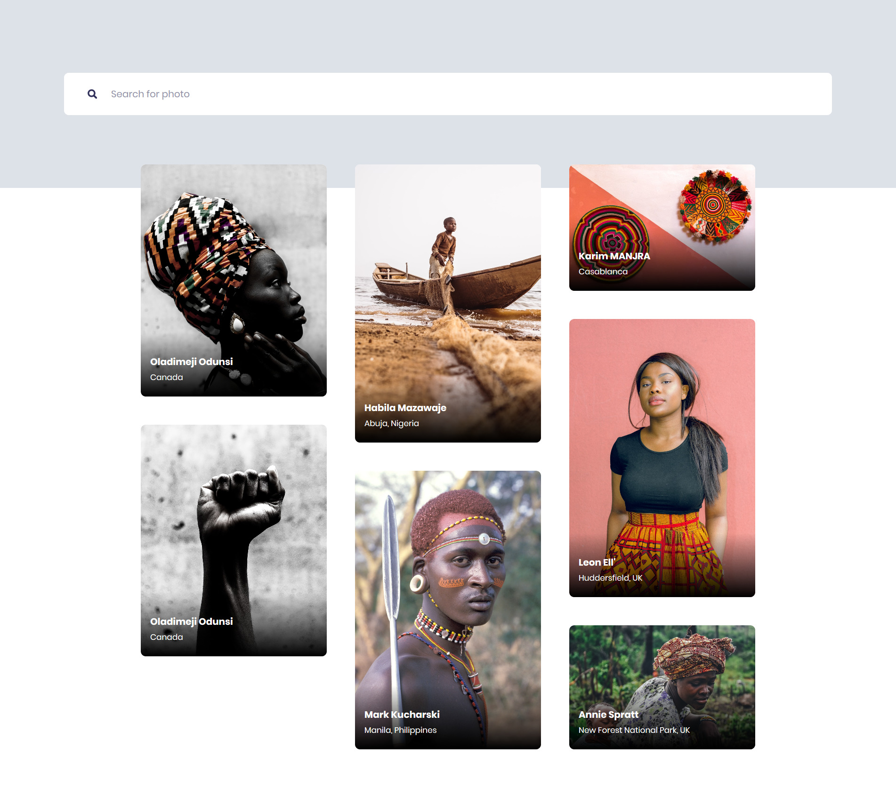

# cowrysplash

## Project setup

```
yarn install
```

### Compiles and hot-reloads for development

```
yarn run serve
```

### Feature set

## 1. Landing Screen: Shows 7 - 8 latest "African" photos from the API



## 2. Search Results Screen


## 3. Loading Placeholders

> Not Yet Done

## 4. Image Modal


### Deployment

The app is deployed to Netlify. Check it out at: [CowrySplash](https://cowrysplash-adebiyi-adedotun.netlify.com/)
